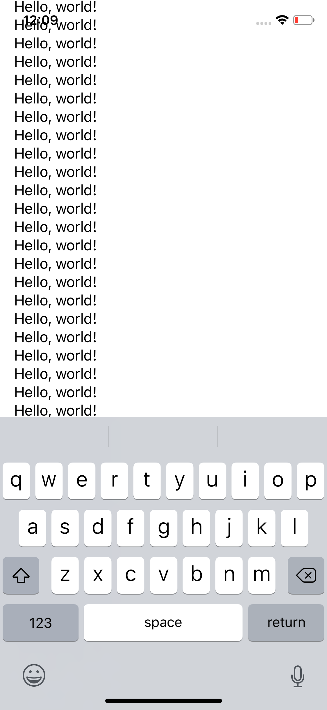
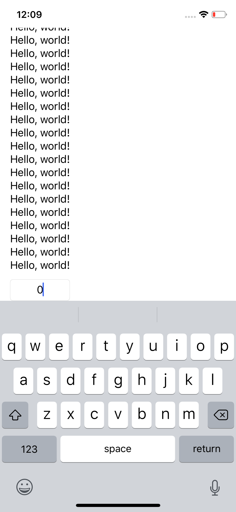

# KeyboardAvoiding

A SwiftUI view that manages a UIViewController that responds to keyboard events with modified additionalSafeAreaInsets.

## Why KeyboardAvoiding?

| Without KeyboardAvoiding | With KeyboardAvoiding |
| ------------------------ | --------------------- |
|  |  |
